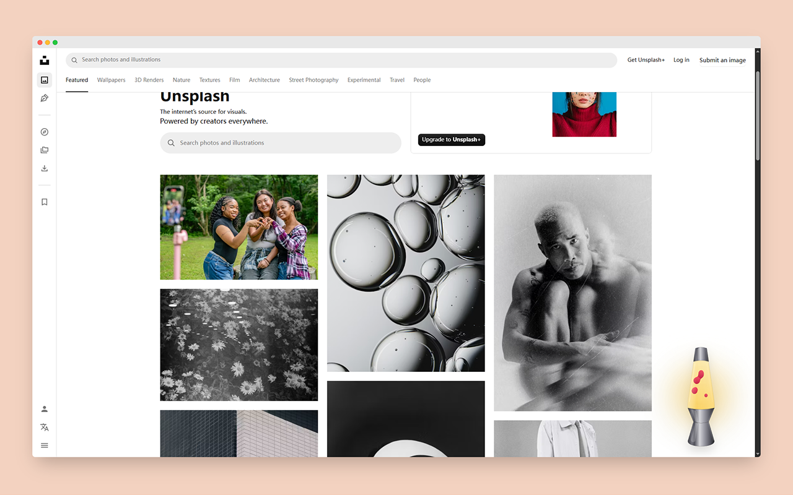
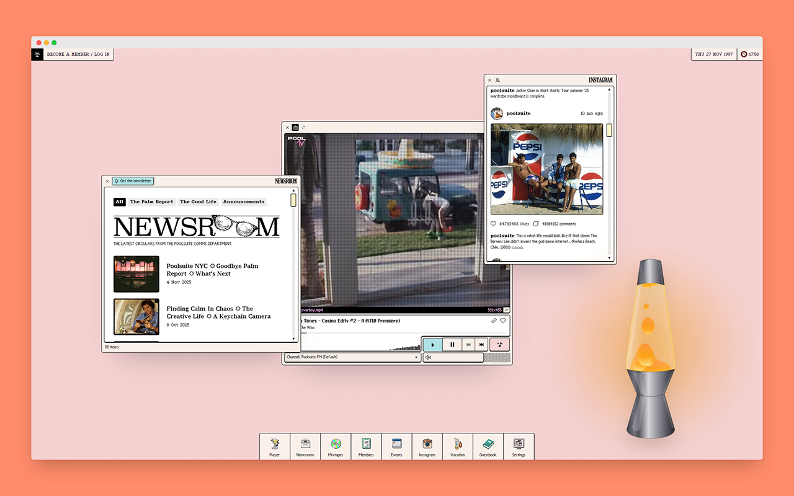
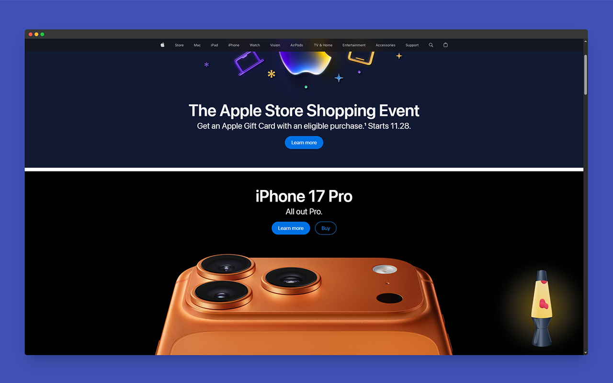

# RetroFlow - 拟真物理熔岩灯 (Physics Lava Lamp)

  
   
  <h3>为你的浏览器注入复古霓虹灵魂</h3>

## 📖 简介 (Introduction)
**RetroFlow** 是一款带有物理惯性与互动小游戏的桌面熔岩灯浏览器扩展。
区别于普通的静态装饰，本插件引入了**实时物理引擎**。当你拖动它时，灯身会根据移动速度产生真实的物理倾斜；每一个熔岩球的拉伸、变形与融合都经过精密计算。

## ✨ 核心特性 (Features)
- 🌊 **极致拟真物理**：独有的流体粘性算法，模拟蜡块受热时的拉伸与融合。
- ⚖️ **动态惯性反馈**：拖拽时灯身会根据速度产生物理倾斜，手感沉甸甸。
- 🔥 **Ignition 点火游戏**：最小化后化为余烬。划动火柴，三连击重新点燃桌面！
- 🎧 **沉浸式声光**：包含真实的擦火柴音效、天使光圈与流光文字提示。
- 🎨 **完全自定义**：支持彩虹流光、暗夜枪灰等多种配色。

## 📸 效果演示 (Showcase)

  
    
  
    
  

## 📥 如何安装 (How to Install)

### 方式一：Edge 商店安装 (推荐)
*(这里等以后你上架了可以填链接)*

### 方式二：手动安装 (免费)
1. 在本页面的右侧点击 **"Releases"**，下载最新的 `.zip` 文件。
2. 打开浏览器扩展管理页面 (`edge://extensions` 或 `chrome://extensions`)。
3. 开启右上角的 **"开发人员模式" (Developer mode)**。
4. 将下载的 `.zip` 文件直接拖入浏览器窗口即可。

## 🛠️ 技术栈 (Tech Stack)
- React + TypeScript
- Vite
- Tailwind CSS
- SVG Filters (Gooey Effect)

---
**© Copyright PILIPLAN**